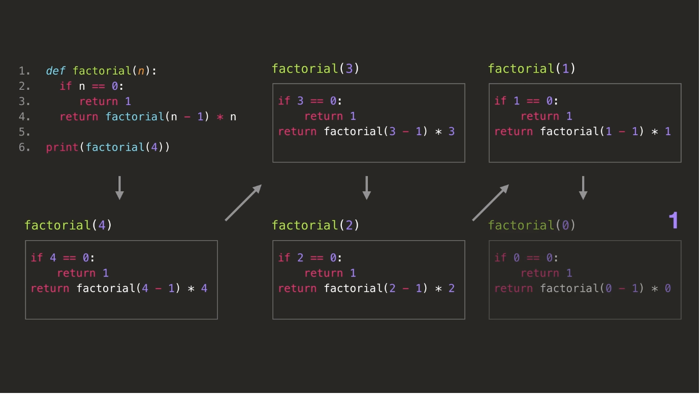

## 알고리즘이란?
### 알고리즘이란?
* 알고리즘이란, 어떤 문제를 해결하기 위한 자세한 방법
* 같은 문제를 해결하기 위해서도 다양한 알고리즘이 존재
* 프로그래밍을 이용해 알고리즘 구
* 알고리즘의 조건
    - 입력: 0개 이상의 입력이 존재해야 한다.
    - 촐력: 1개 이상의 출력이 존재하여야 한다.
    - 명백성: 각 명령어의 의미는 모호하지 않고 명확해야 한다.
    - 유한성: 한정된 수의 단계 후에는 반드시 종료되어야 한다.
    - 유효성: 각 명령어들은 실행 가능한 연산이어야 한다.


### 좋은 알고리즘이란?
* 전체 실행 시간이 짧으면서 메모리와 같은 컴퓨터의 자원들을 적게 사용하는 알고리즘
* 실행 시간이 빠르고 처리를 위해 필요한 기억 공간이 적은 알고리즘
* 시간 복잡도: 알고리즘의 실행 시간 분석
* 공간 복잡도: 알고리즘이 사용하는 기억 공간 분석

### 컴퓨터 알고리즘이란?
* 컴퓨터가 어떤 문제를 해결하기 위해서 컴퓨터가 이해할 수 있는 방식으로 정리되어 있는 해결 방법

### 알고리즘의 중요성
* 처리해야 할 자료의 양이 많아질수록 알고리즘의 효율성이 더욱 중요해진다.
* 사용자들이 여전히 빠른 프로그램을 선호하기 때문에 효율적인 알고리즘이 중요하다.

## 알고리즘 평가법
### 알고리즘 평가의 두 기준
* 시간
    - 최대한 짧은 시간에 주어진 문제를 해결하는 것이 좋은 알고리즘
* 공간
    - 컴퓨터의 저장 공간
    - 메모리를 최대한 적게 사용하는 것이 좋은 알고리즘

### 시간 복잡도(Time Complexity)
* 구현하지 않고서도 알고리즘의 효율성을 따져보는 기법
* 알고리즘 복잡도 분석은 구현하지 않고도 모든 입력을 고려하는 방법으로 실행 하드웨어나 소프트웨어 환경과는 관계없이 알고리즘의 효율성을 평가할 수 있다.
* 알고리즘의 성능을 비교할 때, 프로그램이 돌아가는 시간을 직접적으로 비교하는 것은 합리적이지 않음
* 각 알고리즘을 실행하는 컴퓨터의 성능, 프로그래밍 언어의 속도 등 알고리즘 외에 다양한 환경적 요소들이 알고리즘 실행 시간에 직간접적인 영향을 주기 때문이다.

* 시간 복잡도
    - '**데이터**가 많아질수록 걸리는 시간이 얼마나 **급격히** 증가하는가'를 의미
    - 인풋 크기에 비례하는 알고리즘의 실행 시간
    - 시간 복잡도가 작을수록 더 빠른 알고리즘
    - 시간 복잡도가 클수록 더 느린 알고리즘

### 점근 표기법(Big-O Notation)
* 알고리즘은 일반적으로 입력된 데이터의 크기에 따라 소요되는 시간이 달라진다.
    - 보통 입력된 데이터의 크기가 클수록 소요되는 시간이 길어짐
* 수식하나로 하나의 알고리즘을 완벽하게 표현할 수 없다. -> 알고리즘을 표현할 때 **점근 표기법** 사용
* 점근 표기법
    - 시간 복잡도 함수에서 불필요한 정보를 제거하여 알고리즘 분석을 쉽게 할 목적으로 시간 복잡도를 표시하는 방법을 **빅오 표기법**이라고 한다.
    - 알고리즘의 복잡도를 단순화할 때 사용
    - 원 함수를 단순화하여 최고차항의 차수만을 고려
    - 최고자항을 제외한 모든 항과 최고차항의 계수는 무시
    - n이 굉장히 크다고 가정 -> n이 커질수록 알고리즘의 효율성이 더 중요하게 된다.
    - 절대적인 시간이 아닌 **성장성**에 집중
    - n이 증가함에 따라 **무엇에 비례하는 수의 연산**이 필요한가가 중요

### 공간 복잡도(Space Complexity)
* 인풋 크기에 비례하여 알고리즘이 사용하는 메모리 공간
* 공간 복잡도도 점근 표기법으로 표현할 수 있기 때문에 간편하세 Big-O 표기법 사용

## 재귀 함수
* 재귀적으로 문제를 푼다는 것 
    - a. 기존 문제와 **같은 형태의 더 작은 문제(부분 문제/Subproblem)**을 푼다.
    - b. **부분 문제의 답**을 이용해서 **기존 문제를 푸는 것**
* 재귀 경우
    - base case
        + 이미 문제가 충분히 작아서, 더 작은 부분 문제로 나누지 않고도 바로 답을 알 수 잇는 경우
        + base case 가 없으면 재귀가 끝이나지 않음
    - recursive case
        + 현 문제가 너무 커서, 같은 형태의 더 작은 부분 문제를 재귀적으로 푸는 경우
* 예: n!(n 팩토리얼)
    - base case: n=0인 경우, n!=1
    - recursive case: n>0인 경우, n!=(n-1)!xn
```
def factorial(n):
    if n==0:
        return 1
    return factorial(n-1)*n

print(factorial(4))
```
* 재귀 실행


### 재귀 함수 VS 반복문
* 재귀 함수로 해결할 수 있는 문제는 반복문으로 해결 가능
* 반복문으로 해결할 수 있는 문제는 재귀 함수로 해결 가능
* 재귀 함수의 단점
    - 재귀 함수 호출이 너무 많으면, **call stack**이 계속해서 쌓여, 더이상 기록이 불가능(과부화) -> 이로 인해 프로그램은 중단된다.
    - call stack이 너무 많이 쌓여 한계점에 도달하게 되면 **stack overflow 에러**가 발생
    - python은 심각한 에러 상황을 방지하기 위해서 call stack을 1000개까지만 허가해준다.
        + 따라서 위에서 만든 factorial 함수에 2000과 같이 너무 큰 파라미터를 넘겨주면 파이썬에서는 **RecursionError 발생**
* 재귀 함수를 사용하기 적절한 경우
    - call stack이 쌓이는 것이 크게 문제가 되지 않을 경우
    - 재귀함수로 구현하게되면 간단하지만, 이 문제를 반복문으로 해결하려할 때 굉장히 복잡해지는 경우

### 재귀와 관련되어 도움받은 글
* https://blog.fupfin.com/?p=150